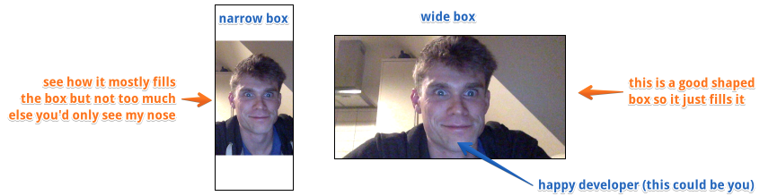

# flood-video

Sometimes you have a video,
And sometimes you have a box.
And sometimes, you want the video to go in the box.

But sometimes, the video, and the box, are not quite the same shape,
So you don't want there to be space around the video,
But you don't want peoples faces to be made too fat, or too thin,
just to make there not be space around the video,
in the box.

It's like you want to say,
Take this video, and just, FILL THE FREAKING BOX WITH IT.
But not too much, because sometimes, the box is very narrow,
So you want to take the video, and just,
FILL THE BOX BUT NOT SO MUCH THAT I CAN ONLY SEE A LITTLE BIT OF THE VIDEO, DO IT SENSIBLY OMG.

If that sounds like you,
then this module,
_might_ make you happy.



## Installation

Works with browserify.

`npm install flood-video --save`

## Usage

See a [demo here](http://latentflip.com/flood-video)

### floodVideo(wrapperElement, videoElement, [options])

* options:
* minVisibleHeight: a number (from 0 to 1) how much of the vertical height of the video to ensure is always visible
* minVisibleWidth: a number (from 0 to 1) how much of the horizontal width of the video to ensure is always visible

```js
var floodVideo = require('flood-video');

var floodController = floodVideo(wrapperEl, videoEl, options);

floodController.forceFlood() //refit the video, if you've changed style/dimension of the wrapper/video (need not be called if element resizes due to window resize)

floodController.stop() // stop listening to window resize events, clear up handlers, remove classes

floodController.configure({
    minVisibleHeight: 0.5,
    minVisibleWidth: 0.5
}); //reconfigure the options (all options are optional, and the same as the floodVideo() call
```
